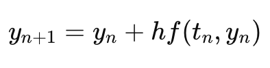
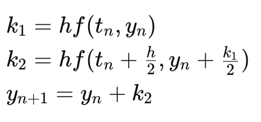
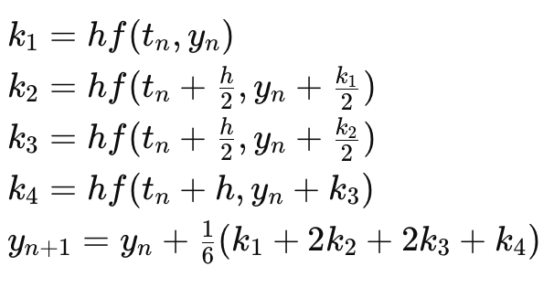

# Numerical Methods for Solving ODEs

This documentation provides an overview of numerical methods for solving ordinary differential equations (ODEs) using Python. The methods covered include the Euler method, the second-order Runge-Kutta method (RK2), and the fourth-order Runge-Kutta method (RK4).

## Euler Method

The Euler method is a first-order numerical procedure for solving ODEs. It is the simplest Runge-Kutta method.

The formula for the Euler method is:



which is the same as:

```
y_next = y_current + h * f(t_current, y_current)
```

where:

- `y_next` is the approximated solution at the next point.
- `y_current` is the current value of the solution.
- `h` is the step size.
- `f(t_current, y_current)` is the derivative of y at `t_current`.

## Second-order Runge-Kutta Method (RK2)

The second-order Runge-Kutta method provides better accuracy than the Euler method.

The formula for RK2 is:



which is the same as:

```
k1 = h * f(t_current, y_current)
k2 = h * f(t_current + h/2, y_current + k1/2)
y_next = y_current + k2
```

where:

- `k1` and `k2` are intermediate increments.
- `y_next` is the approximated solution at the next point.

## Fourth-order Runge-Kutta Method (RK4)

The fourth-order Runge-Kutta method is one of the most widely used methods due to its balance between simplicity and accuracy. The formula for RK4 is:



which is the same as:

```
k1 = h * f(t_current, y_current)
k2 = h * f(t_current + h/2, y_current + k1/2)
k3 = h * f(t_current + h/2, y_current + k2/2)
k4 = h * f(t_current + h, y_current + k3)
y_next = y_current + (k1 + 2*k2 + 2*k3 + k4) / 6
```
where:

- `k1`, `k2`, `k3`, and `k4` are intermediate increments.
- `y_next` is the approximated solution at the next point.


---

## Reference

For detailed documentation of the functions, visit the [Reference Page](reference.md).

These numerical methods are fundamental for solving ODEs and are widely used in various scientific and engineering applications.
